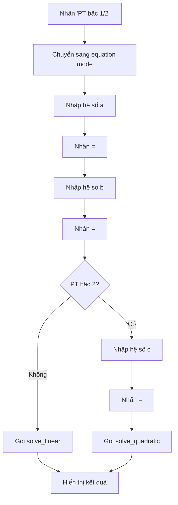

# 📋 TÀI LIỆU KỸ THUẬT - CALCULATOR

## 🏗️ KIẾN TRÚC HỆ THỐNG

### Mô Hình MVC (Model-View-Controller)

Dự án được thiết kế theo mô hình MVC để đảm bảo tính modular và dễ bảo trì:

```
┌─────────────────────────────────────────────┐
│                    VIEW                     │
│  ┌─────────────────┐ ┌─────────────────┐   │
│  │   display.py    │ │   buttons.py    │   │
│  │  (Hiển thị)     │ │   (Nút bấm)     │   │
│  └─────────────────┘ └─────────────────┘   │
└─────────────────────────────────────────────┘
                        ▲
                        │
┌─────────────────────────────────────────────┐
│                CONTROLLER                   │
│  ┌─────────────────────────────────────────┐ │
│  │           calculator.py                 │ │
│  │        (Xử lý sự kiện)                  │ │
│  └─────────────────────────────────────────┘ │
└─────────────────────────────────────────────┘
                        ▲
                        │
┌─────────────────────────────────────────────┐
│                   MODEL                     │
│  ┌─────────────────┐ ┌─────────────────┐   │
│  │  equations.py   │ │    utils.py     │   │
│  │ (Logic tính)    │ │  (Tiện ích)     │   │
│  └─────────────────┘ └─────────────────┘   │
└─────────────────────────────────────────────┘
```

## 📦 CHI TIẾT CÁC MODULE

### 1. Main Module (`main.py`)
**Chức năng**: Entry point của ứng dụng
```python
# Khởi tạo tkinter và chạy ứng dụng
import tkinter as tk
from logic.calculator import Calculator

if __name__ == "__main__":
    root = tk.Tk()
    app = Calculator(root)
    root.mainloop()
```

### 2. Logic Module (`logic/`)

#### 2.1 Calculator Core (`logic/calculator.py`)
**Chức năng**: Controller chính, xử lý tất cả logic và sự kiện

**Class: Calculator**
- **Thuộc tính chính**:
  ```python
  self.cal = ""              # Biểu thức tính toán thực tế
  self.display_cal = ""      # Biểu thức hiển thị đẹp
  self.history = []          # Lịch sử tính toán
  self.linear_mode = False   # Chế độ giải PT bậc 1
  self.quadratic_mode = False # Chế độ giải PT bậc 2
  ```

- **Phương thức chính**:
  - `handle_button(char)`: Xử lý sự kiện nút bấm
  - `calculate()`: Thực hiện tính toán chính
  - `solve_linear_equation_step()`: Giải PT bậc 1 từng bước
  - `solve_quadratic_equation_step()`: Giải PT bậc 2 từng bước

#### 2.2 Equation Solver (`logic/equations.py`)
**Chức năng**: Module xử lý giải phương trình

**Hàm chính**:
- `solve_linear_equation(a, b)`: Giải PT bậc 1: ax + b = 0
  - Xử lý trường hợp a = 0 (vô nghiệm/vô số nghiệm)
  - Return: String kết quả
  
- `solve_quadratic_equation(a, b, c)`: Giải PT bậc 2: ax² + bx + c = 0
  - Tính delta = b² - 4ac
  - Xử lý 3 trường hợp: delta > 0, delta = 0, delta < 0
  - Return: String kết quả với x₁, x₂

#### 2.3 Utilities (`logic/utils.py`)
**Chức năng**: Các hàm tiện ích hỗ trợ

**Hàm chính**:
- `convert_deg_min_sec(expr)`: Chuyển đổi độ phút giây sang decimal
  - Hỗ trợ format: sin(30'45'30') → sin(30 + 45/60 + 30/3600)
  - Sử dụng regex để parse và thay thế

- `parse_int_value(value)`: Parse số từ các hệ số khác nhau
  - Binary: 0b prefix
  - Hexadecimal: 0x prefix  
  - Octal: 0o prefix
  - Decimal: mặc định

### 3. UI Module (`ui/`)

#### 3.1 Display Interface (`ui/display.py`)
**Chức năng**: Tạo giao diện hiển thị

**Thành phần**:
- Input label: Hiển thị phép tính đang nhập
- Result label: Hiển thị kết quả 
- History listbox: Danh sách 10 phép tính gần nhất

#### 3.2 Button Interface (`ui/buttons.py`)
**Chức năng**: Tạo bố cục nút bấm

**Layout Matrix 8x5**:
```
[ (  )  AC  Del  x10^n ]
[sin cos tan cotan log ]
[ √  ³√  ⁿ√  PT1  PT2 ]
[Bin Dec Hex Oct   '  ]
[ 7   8   9   +   x²  ]
[ 4   5   6   -   x³  ]
[ 1   2   3   x   xⁿ  ]
[ 0   .   =   /   x⁻¹ ]
```

## 🔄 LUỒNG HOẠT ĐỘNG

### 1. Luồng Tính Toán Cơ Bản
```mermaid
graph TD
    A[Nhấn nút] --> B[handle_button()]
    B --> C{Loại nút?}
    C -->|Số/Toán tử| D[Cập nhật cal & display_cal]
    C -->|=| E[calculate()]
    E --> F[eval() với safe context]
    F --> G[Hiển thị kết quả]
    G --> H[Lưu vào history]
```

### 2. Luồng Giải Phương Trình


## 🛡️ XỬ LÝ LỖI & BẢO MẬT

### 1. Safe Expression Evaluation
```python
# Sử dụng eval với context bị giới hạn
result = eval(expr, {"__builtins__": None}, {
    "sin": lambda x: sin(radians(x)),
    "cos": lambda x: cos(radians(x)),
    # ... chỉ các hàm an toàn
})
```

### 2. Input Validation
- Kiểm tra hệ số phương trình có hợp lệ không
- Xử lý division by zero
- Validate format số trong chuyển đổi hệ

### 3. Error Handling
- Try-catch cho tất cả phép tính
- MessageBox thông báo lỗi rõ ràng
- Auto-clear khi gặp lỗi

## ⚡ TỐI ƯU HÓA PERFORMANCE

### 1. Memory Management
- History giới hạn 10 items
- Clear unused variables
- Efficient string operations

### 2. UI Responsiveness  
- Separate display và calculation strings
- Immediate UI updates
- Background processing cho complex calculations

## 🔧 PATTERN & BEST PRACTICES

### 1. Design Patterns Sử Dụng
- **Facade Pattern**: Calculator class che giấu complexity
- **Observer Pattern**: History display tự update
- **Command Pattern**: Button handlers

### 2. Code Organization
- Modular structure với clear separation
- Descriptive naming conventions
- Comprehensive error handling
- Documentation strings

### 3. Testing Strategy
- Manual testing for UI components
- Unit tests for mathematical functions
- Edge case testing (overflow, division by zero)
- Cross-platform compatibility

## 📈 METRICS & PERFORMANCE

| Metric | Value |
|--------|-------|
| Lines of Code | ~450 |
| Classes | 1 main class |
| Functions | ~15 functions |
| Modules | 5 modules |
| Dependencies | 3 (tkinter, math, re) |
| Startup Time | <1s |
| Memory Usage | ~10MB |

## 🚀 KHẢ NĂNG MỞ RỘNG

### Có thể thêm:
1. **Calculus Functions**: đạo hàm, tích phân
2. **Statistical Functions**: mean, median, std
3. **Matrix Operations**: phép tính ma trận
4. **Graphing**: vẽ đồ thị hàm số
5. **Export/Import**: lưu lịch sử ra file
6. **Themes**: nhiều giao diện màu sắc
7. **Scientific Constants**: π, e, c, h...

### Cách mở rộng:
1. Thêm functions vào `safe_context` trong `calculate()`
2. Tạo new buttons trong `buttons.py`
3. Handle new button events trong `handle_button()`
4. Thêm logic processing trong calculator class

---

*Tài liệu kỹ thuật này cung cấp cái nhìn sâu về architecture và implementation details của Calculator project.*
